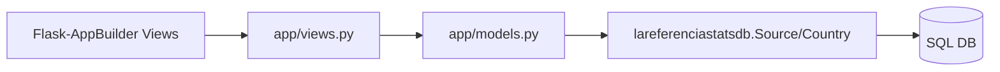

# lareferencia-usage-stats-admin

Backoffice de administración de metadatos de estadísticas. Está construido con Flask-AppBuilder y opera sobre los modelos compartidos `Source` y `Country` del paquete `lareferenciastatsdb`.

## Qué resuelve

- Alta/edición de fuentes (`Source`) que determinan:
  - `site_id` y jerarquía nacional/regional.
  - `auth_token` de Matomo.
  - reglas de mapeo de identificador (`identifier_map_*`).
- Alta/edición de países (`Country`) con `site_id` y token.
- Exposición de vistas CRUD y APIs automáticas de Flask-AppBuilder.

## Arquitectura interna



Archivos clave:

- `app/__init__.py`: inicializa Flask, SQLA y AppBuilder.
- `app/models.py`: importa `Source` y `Country` (no redefine tablas).
- `app/views.py`: define `SourceView` y `CountryView`, columnas, labels y APIs.
- `config.py`: configuración principal de Flask/AppBuilder.
- `run.py`: arranque rápido para desarrollo.

## Ejecución local

1. Instalar dependencias:

```bash
pip install -r requirements.txt
```

2. Ejecutar:

```bash
python run.py
```

Servidor por defecto: `http://0.0.0.0:8080`.

## Integración con otros módulos

- Alimenta la metadata usada por:
  - `processor` para decidir cómo normalizar/agregar/indexar.
  - `service` para resolver índices OpenSearch de una consulta.
  - `config_service` para emitir archivos de configuración por `OPENDOAR::<id>`.

## Configuración relevante

- `SQLALCHEMY_DATABASE_URI` en `config.py` apunta por defecto a `sqlite:///app.db`.
- En producción debería apuntar a la DB compartida de estadísticas para que todos los componentes vean el mismo catálogo de fuentes.

## Notas operativas

- `app/views.py` ejecuta `db.create_all()` al cargar módulo.
- Si hay desalineación de esquema entre DB real y modelos, puede haber efectos inesperados.
- Hay archivos legacy (`README`, `README.rst`) de scaffold original; este README documenta el comportamiento actual observado en código.
